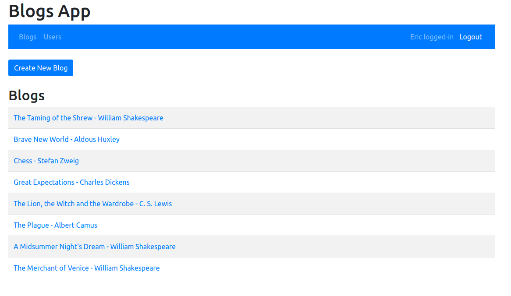

# Full Stack Open 2021 - Part 11

## Blogs App

The following repository contains code for Blogs, a full stack web application with a fully set-up CI/CD pipeline. The project is built on the MongoDB, Express, React, and Node.js stack and integrated with GitHub Actions.

